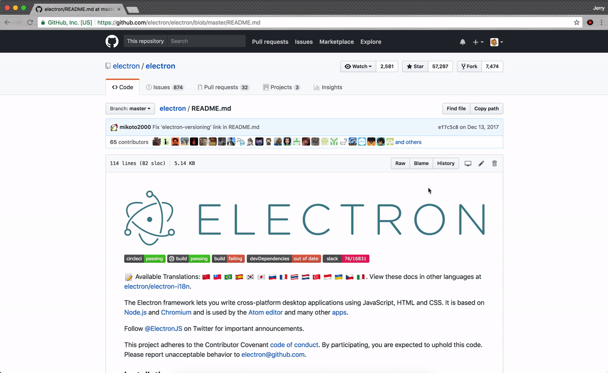

# github-markdown-printer
Chrome extension to print GitHub Flavored Markdown exactly as it appears on GitHub. You can also save them as PDFs.

Install it from the [Chrome Web Store](https://chrome.google.com/webstore/detail/github-markdown-printer/fehpdlpmcegfpbkgcnaleindodeegapk).

### Advantages over other markdown converters
This is easier and faster than downloading the markdown file and running it through a converter. This also produces better results.

## Usage
1. Go to any page on GitHub where a markdown preview is visible.
2. Click on the GMP icon which will open the print dialog with a print preview.
3. Select your printer or save as PDF and print.

## Troubleshooting
If you're experiencing an issue that isn't listed below, please [submit an issue](https://github.com/jerry1100/github-markdown-printer/issues/new).

### Words are cut off
Try adjusting the margins. In the print preview, click "More settings" and "Margins". Adjust them until the words are not cut off anymore.

### Code blocks aren't shaded
Make sure "Background graphics" are enabled in the print preview. To check, click "More settings" in the print preview, then look for "Background graphics".
