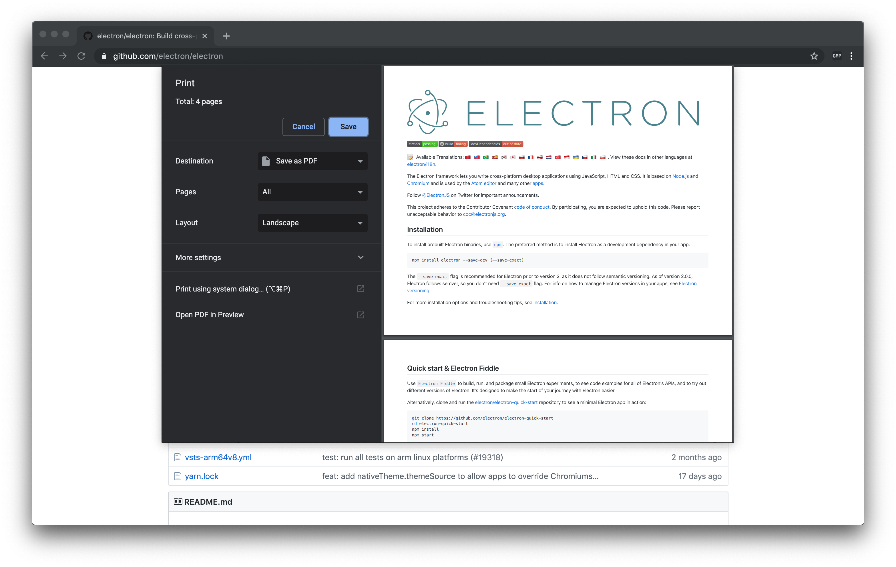
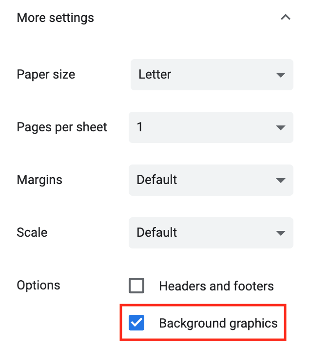

# github-markdown-printer 

Chrome/Edge extension to print GitHub Flavored Markdown *exactly* as it appears on GitHub, with just two clicks.

Get it from the [Chrome Web Store](https://chrome.google.com/webstore/detail/github-markdown-printer/fehpdlpmcegfpbkgcnaleindodeegapk) or the [Edge Web Store](https://microsoftedge.microsoft.com/addons/detail/github-markdown-printer/njdhaokfdmnighagdlhbfpkmcgojljcl).

  

### Advantages over other markdown converters
This is easier and faster than downloading the markdown file and running it through a converter. This also produces better results.

## Usage
1. Go to any page on GitHub where a markdown preview is visible.
2. Click on the GMP icon which will open the print dialog with a print preview.
3. Select your printer or save as PDF and print.

## Troubleshooting
If you're experiencing an issue that isn't listed below, please [submit an issue](https://github.com/jerry1100/github-markdown-printer/issues/new).

### Code blocks aren't shaded
Make sure "Background graphics" are enabled in the print preview. To check, click "More settings" in the print preview, then look for "Background graphics".

### Indentation is weird in code blocks
Long pieces of code that do not fit within the page will be wrapped to the next line. This wrapping may mess up the indentation.
